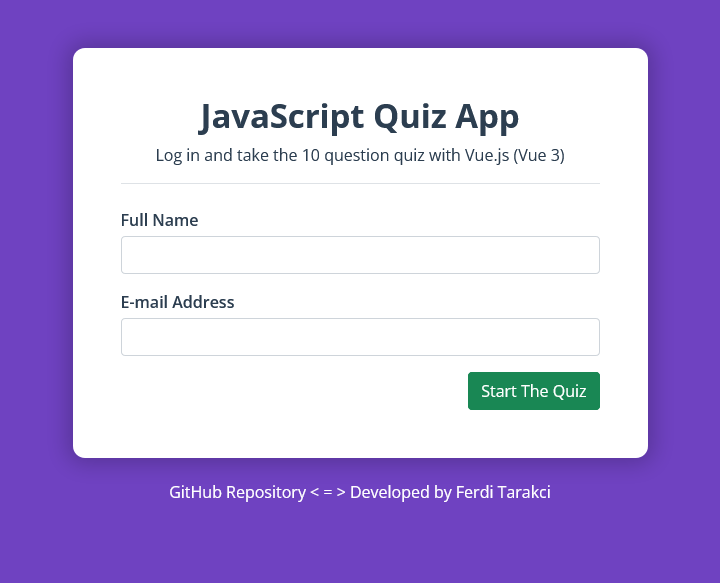
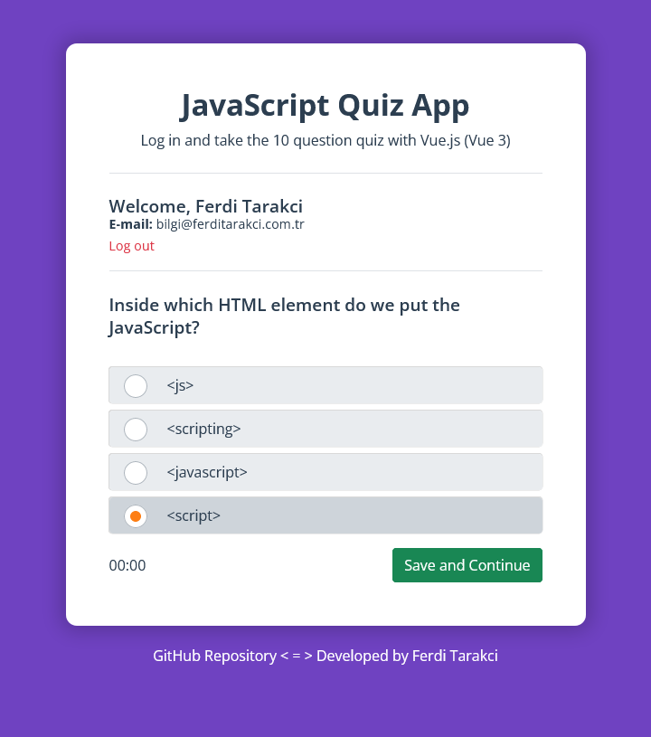
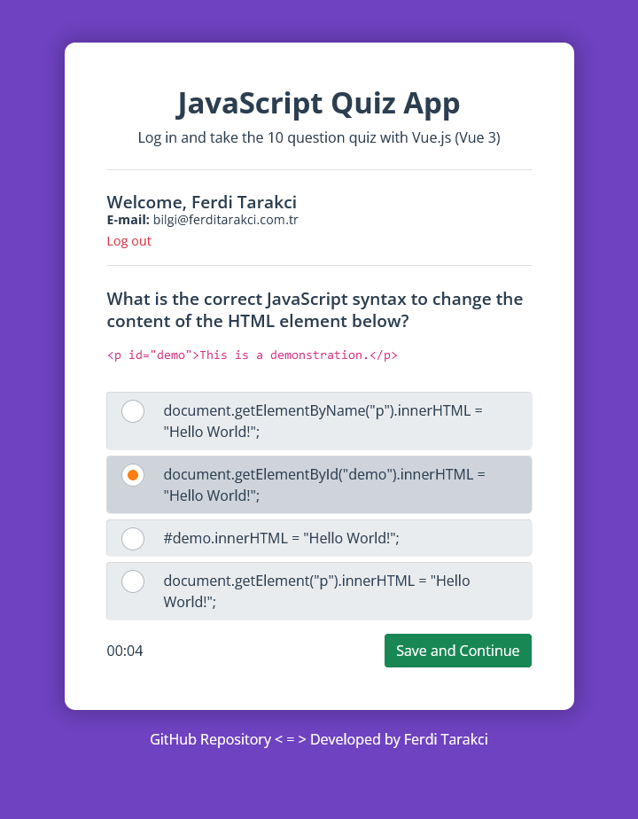
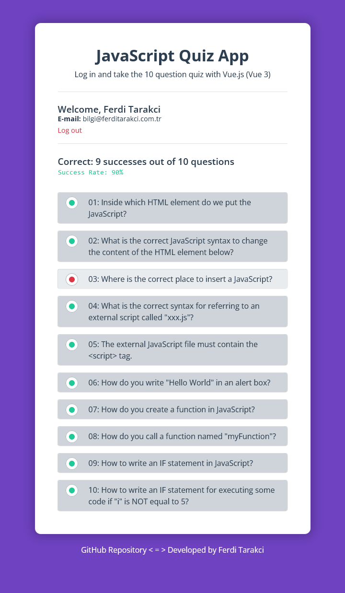

# Quiz App with Vue.js

## App Link
https://quiz.ferditarakci.com.tr

https://ferditarakci-quiz-app-vue-js.vercel.app

<br>
<br>

## Project setup
```
npm install
```

### Compiles and hot-reloads for development
```
npm run serve
```

### Compiles and minifies for production
```
npm run build
```

### Lints and fixes files
```
npm run lint
```

### Customize configuration
See [Configuration Reference](https://cli.vuejs.org/config/).


## Screenshots


<br /><br />

<br /><br />

<br /><br />

